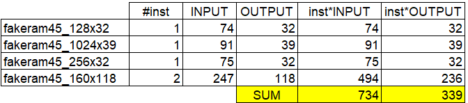
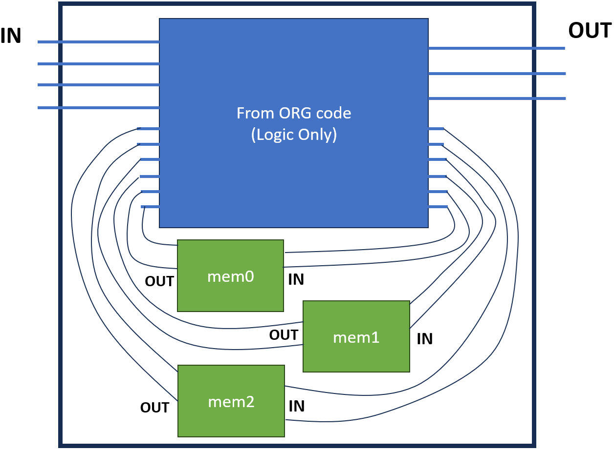

# How to create ANG-Macro

Here, ANG-Macro means 'macro-integrated artificial netlist'

1. Setup ANG environment
  - Refer to the ANG GitHub repository \[[GitHub](https://github.com/daeyeon22/artificial_netlist_generator)\]

2. Select macro type and count. In this example, we select 4 types of macros, total 5 instances
  - u_mem_0: fakeram45_128x32  
  - u_mem_1: fakeram45_1024x39 
  - u_mem_2: fakeram45_256x32  
  - u_mem_3: fakeram45_160x118 
  - u_mem_4: fakeram45_160x118 

3. LEF setting in 'ang_lib_setup.tcl' file
  - Example fakeram LEFs are uploaded on 'macroLEFs' folder
  - Other tech LEF and std. cell LEF can be downloaded from \[[GitHub](https://github.com/The-OpenROAD-Project/OpenROAD-flow-scripts/tree/master/flow/platforms/nangate45/lef)\]
  - Put in tech LEF and std. cell LEF download path into the 'ng45lefdir' of 'ang_lib_setup.tcl' file

4. Calculate sum of macro input pins and output pins
  - Example calculation is presented in the table below
 

5. Insert parameters for SPEC file generation. Parameter details can be found from \[[GitHub](https://github.com/The-OpenROAD-Project/OpenROAD-flow-scripts/tree/master/flow/platforms/nangate45/lef)\]
  - Example parameters
    - num_insts: 20,000
    - num_primary_ios: 1,303
      - input = target block input count (130) + macro output count (339) = 469
      - output = target block output count (100) + macro input count (734) = 834
      - num_primary_ios = 469 + 834 = 1,303
    - comb_ratio: 0.85
    - avg_bbox: 0.1
    - avg_net_degree: 2.5
    - avg_topo_order: 10

6. Run gen_spec.tcl for SPEC file generation
  - Command: ./openroad gen_spec.tcl

7. Adjust I/O pad count values in the generated SPEC file 
  - IPAD_COUNT: 651 -> 468
  - OPAD_COUNT: 651 -> 834

8. Run run_artnetgen.tcl to generate the first artificial netlist
  - Command: ./openroad run_artnetgen.tcl

9. Run insert_macros.sh to integrate macro cells
  - Command: ./insert_macros.sh
  - Macro connection scheme is described in the figure below

 

