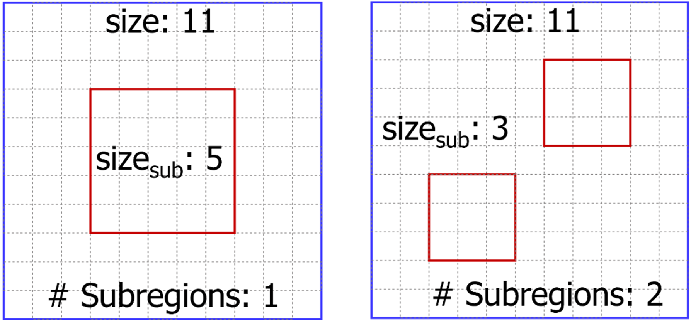

# Tomography
This repository contains codes for the Tomography project, designed to utilize placement tomography features for DRC hotspot prediction and to generate routing blockages for hotspot mitigation.
And it also contains data generation scripts required for training and testing.

## PROBE
For details, click [here](./DataGeneration/PROBE/README.md).

|  |
|:--:|
| *PROBE Parameters* |

## ANG-Macro 
For details, click [here](./DataGeneration/ANGmacro/README.md).

|  |
|:--:|
| *Description of Macro Integration* |
## ML Model, Training and Testing
For details, clis [here](./ml/README.md).

## Flow scripts
For details, click [here](./backend/README.md).

