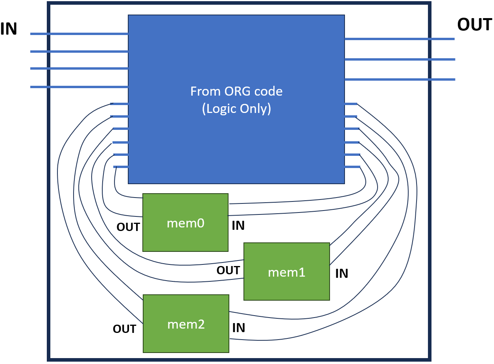

# Tomography
This repository contains codes for the Tomography project, designed to utilize placement tomography features for DRC hotspot prediction and to generate routing blockages for hotspot mitigation.

## PROBE

  - **size**: top region size
  - **sub_sizes_train**: subregion sizes for **training** data
  - **sub_sizes_test**: subregion sizes for **testing** data
  - **counts**: number of subregions
  - **loc_comb**: number of subregion location combinations
  - **k1**: cell swap counts for the whole region
  - **k2**: cell swap counts for each subregion

## ANG-Macro 
For details, click [here](./DataGeneration/ANGmacro/README.md).

|  |
|:--:|
| *Macro Integration Description* |
